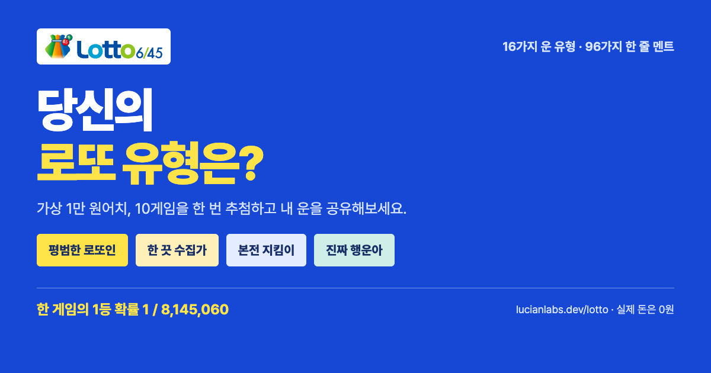

# 로또 시뮬레이션 · Lotto Simulation

[무료로 돌려보기](https://lucianlabs.dev/lotto/) · [GitHub](https://github.com/Seokwoooo/lotto-simulation)

로또 100만원치, 1,000게임을 한 번 추첨하면 내 운은 어떨까요?
구매 영수증에서 번호를 먼저 확인하고 추첨하면 내 로또 운 유형이 나옵니다.
구매 게임 수와 추첨 횟수를 바꿔 장기간 실험할 수도 있습니다.



## 기능

- 결과 영수증 아래의 “이번에는 1억원치 돌려보기”로 자동 1,000게임 × 100회, 총 100,000게임을 바로 추첨합니다. 누적 결과와 마지막 회차의 전체 영수증을 표시합니다.
- 기본 1,000게임·1회 추첨. “100만원치 바로 돌려보기”, 가상 구매 1,000,000원, 실제 지출 0원.
- 1,000게임을 5게임씩 200장의 영수증으로 나눠 표시. 추첨 전 전체 번호를 넘겨보거나 원하는 영수증으로 바로 이동하고, 자동 번호를 다시 뽑을 수 있습니다.
- 결과는 가장 잘 맞힌 게임이 있는 영수증부터 표시. 5게임씩 전체 영수증을 넘겨볼 수 있고, 당첨번호는 빨간 동그라미, 보너스는 파란 점선으로 표시.
- 추첨 1~100,000회, 매회 1~1,000게임. 한 실험은 최대 1,000,000게임.
- 매번 자동 번호 또는 직접 마킹한 6개 번호를 모든 회차·게임에 고정.
- 중복 없는 당첨번호 6개와 별도 보너스 번호. 실제 로또 등수 규칙.
- Web Worker에서 12ms 단위로 계산하고, 진행률은 최대 10Hz로 갱신. 진행 메시지에는 복권 배열을 보내지 않으며, 완료 시 마지막 회차 최대 1,000게임만 전달합니다. 중단 시 완료한 회차만 집계.
- 가상 비용, 등수별 당첨 수, 예시 당첨금과 가상 손익.
- 추첨 후 결과 전용 화면으로 이동. 최고 등수·당첨 수·손익·마지막 회차의 근접 결과에 따른 16가지 운 유형.
- 오리지널 로또 공 캐릭터 5종, 16가지 운 유형, 유형별 6가지 한 줄 멘트(총 96개). 유형 풀이와 실제 결과 요약.
- 도전장 링크를 열면 친구의 결과를 그대로 재현. 같은 금액·설정, 새 시드로 도전하고 실제 가상 당첨금을 비교합니다.
- 캐릭터·운 유형·가상 당첨금이 담긴 1080×1440 결과 카드 PNG 저장과 지원되는 기기의 네이티브 공유.
- 모바일, 키보드, 스크린 리더, 모션 감소 설정 지원.

로그인, 결제, 실제 구매, 번호 예측 기능은 없습니다. 추첨은 브라우저에서 계산합니다.
게임 수에 비례하는 서버 요청이나 저장소 쓰기는 없습니다. 정적 파일은 CDN에서 전달하며,
동시 방문자가 늘어도 시뮬레이션 연산은 각 사용자의 기기에 분산됩니다. 트래픽·호스팅 한도는 별도로 적용됩니다.
공유 링크에는 번호 설정, 재현용 시드와 수동 번호가 들어갑니다.

## 실행

런타임 의존성과 빌드 과정이 없는 HTML/CSS/JavaScript 사이트입니다.
정적 웹 서버에서 열어주세요. `file://`에서는 모듈과 Worker가 작동하지 않습니다.

```sh
python3 -m http.server 4176 --bind 127.0.0.1
```

[로컬 미리보기](http://127.0.0.1:4176/)

검증은 Node.js 20 이상에서 실행합니다. `npm install`은 필요하지 않습니다.

```sh
npm test
```

## 확률과 당첨금

1등 확률은 정확히 `1 / C(45, 6) = 1 / 8,145,060`입니다.
자동 모드는 각 게임의 번호를 독립적으로 고르므로 중복 조합이 나올 수 있습니다.
N게임 중 1등이 한 번 이상 나올 확률은 `1 - (1 - 1/8,145,060)^N`입니다.
계산은 작은 확률에서도 정밀도를 유지하는 `log1p`와 `expm1`을 사용합니다.

고정 모드는 매회 모든 게임이 같은 번호입니다. 한 회차에 같은 번호를 여러 장
사도 1등을 만날 확률은 늘지 않으므로 누적 확률의 N은 추첨 횟수입니다.
당첨 시 해당 회차의 동일 번호 게임은 모두 같은 등수로 집계합니다.

| 등수 | 조건 | 이 실험의 세전 금액 |
| --- | --- | --- |
| 1등 | 6개 일치 | **예시** 20억 원 |
| 2등 | 5개 + 보너스 일치 | **예시** 5,000만 원 |
| 3등 | 5개 일치, 보너스 불일치 | **예시** 150만 원 |
| 4등 | 4개 일치 | 고정 5만 원 |
| 5등 | 3개 일치 | 고정 5천 원 |

실제 1~3등 금액은 판매액과 당첨자 수에 따라 변합니다. 이 시뮬레이터는 세금,
판매액, 당첨자 간 배분과 이월을 구현하지 않습니다. 가상 회수율은 이번 결과의
예시 당첨금 / 가상 구매 비용이며 실제 복권의 기대 회수율이 아닙니다.
이전 결과는 다음 회차의 당첨 확률을 바꾸지 않습니다.

## 추첨 구현

`core.js`는 DOM과 분리된 추첨 모델입니다. `worker.js`가 짧은 시간 단위로
실행·중단하며 `app.js`는 구매 영수증, 결과 화면과 공유를 담당합니다.
`profiles.js`는 실제 실험 결과를 바탕으로 재미있는 별명과 풀이를 고릅니다.
심리검사나 실제 운의 측정이 아닙니다. 시드에 따라 한 줄 멘트도 재현됩니다.

번호 미리보기는 동일 시드의 첫 회차에서 구매 번호만 가져옵니다.
실제로 시작할 때 그 시드를 사용하므로 구매 번호가 추첨 도중 바뀌지 않습니다.
연속 추첨은 마지막 회차의 전체 구매 번호를 영수증 5게임씩 넘겨 표시합니다.
새 공유 링크의 `#result`는 결과 화면을 바로 열고, `c=1`은 친구 도전장을 표시합니다. 기존 버전 1 링크도 지원합니다.
친구와의 비교는 도전하는 브라우저 세션 안에서만 유지되며, 내 결과를 다시 공유하면 내 결과가 새 도전장의 기준이 됩니다.

초기 128비트 시드는 `crypto.getRandomValues`로 만듭니다. 재현 가능한
xoshiro128** PRNG, 모듈로 편향을 제거하는 rejection sampling, 부분 Fisher–Yates
셔플을 사용합니다. PRNG는 시뮬레이션용이며 실제 복권 번호 예측용이 아닙니다.
공유 버전 1의 PRNG, 샘플 순서 또는 등수 규칙을 바꾸면 `VERSION`을 올려야 합니다.

## 라이선스

원본 코드, 문서와 생성한 로또 공 캐릭터는 MIT입니다. 공식 로또·동행복권 로고는 원 권리자의 자산이며
MIT 라이선스 대상이 아닙니다. 글꼴의 OFL 라이선스와 공식 자산 출처는
[CREDITS.md](CREDITS.md)에 있습니다. 이 사이트는 동행복권의 공식 서비스가 아닙니다.
